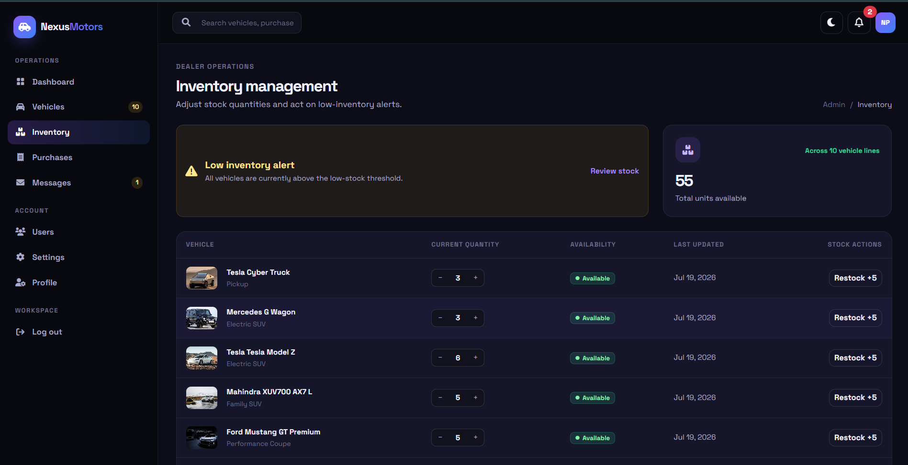

# 🚗 Car Dealership Inventory Management System

<div align="center">


**A Django-based inventory management system developed using Test-Driven Development (TDD) principles.**

Designed to help a car dealership efficiently manage vehicle inventory, stock operations, user authentication, searching, and administrative tasks through a clean and responsive web interface.

</div>

---

# 📖 Project Overview

The **Car Dealership Inventory Management System** is a web application built with **Python** and **Django** that enables a dealership to manage its vehicle inventory through a centralized platform.

The application allows authenticated users to browse available vehicles, perform inventory-related operations, search the catalog, and manage dealership data efficiently. Administrators have additional privileges to maintain inventory records, monitor stock levels, and oversee dealership operations.

The project was developed by following the **Test-Driven Development (TDD)** methodology, where application features were verified using automated tests throughout the development process. This approach improves software reliability, maintainability, and code quality.

The application follows Django's **Model–View–Template (MVT)** architecture and emphasizes clean code organization, modular development, and professional software engineering practices.

---

## 🎯 Project Objectives

The primary objectives of this project are to:

- Develop a modular Django web application
- Demonstrate Test-Driven Development (TDD)
- Manage dealership vehicle inventory
- Maintain accurate stock information
- Implement secure authentication and authorization
- Provide efficient vehicle search functionality
- Ensure robust validation and error handling
- Deliver a responsive user interface using Bootstrap

---

## 🏗️ Key Highlights

- ✅ Django MVT Architecture
- ✅ Authentication & Authorization
- ✅ Vehicle Inventory Management
- ✅ Inventory Purchase & Restocking
- ✅ Search & Filtering
- ✅ Admin Dashboard
- ✅ Server-side Validation
- ✅ Automated Testing (TDD)
- ✅ Responsive Bootstrap Interface
- ✅ SQLite Database

---

# ✨ Features

The application provides the following core functionalities.

## 🔐 Authentication

- User Registration
- Secure Login
- Logout
- Session Management
- Password Protection
- Role-based Access Control

---

## 🚗 Vehicle Management

- Add New Vehicles
- View Vehicle Inventory
- Update Vehicle Information
- Delete Vehicles
- Vehicle Detail View
- Vehicle Availability Status

---

## 📦 Inventory Operations

- Purchase Vehicles
- Restock Inventory
- Automatic Stock Updates
- Inventory Quantity Tracking
- Prevent Invalid Stock Operations

---

## 🔍 Search & Filtering

Users can quickly locate vehicles using built-in search functionality.

Supported search options include:

- Vehicle Make
- Vehicle Model
- Category
- Availability
- Price-based Filtering

---

## 📊 Dashboard

The dashboard provides a quick overview of dealership information.

Features include:

- Total Vehicles
- Available Inventory
- Low Stock Monitoring
- Recent Inventory Activity
- Quick Navigation

---

## 👨‍💼 Administrative Features

Administrators can:

- Manage vehicle inventory
- Monitor stock availability
- View purchase history
- Access protected management pages
- Perform administrative operations securely

---

## ✅ Validation & Error Handling

The application implements comprehensive validation to maintain data integrity.

Includes:

- Required Field Validation
- Price Validation
- Quantity Validation
- Duplicate Record Prevention
- Authentication Validation
- Permission Validation
- Custom Error Pages (403, 404, 500)

---

## 🧪 Test-Driven Development (TDD)

The project follows TDD principles throughout development.

Automated tests cover:

- Authentication
- Vehicle CRUD Operations
- Inventory Management
- Search Functionality
- Validation
- Permission Checks
- Error Handling

---

## 📱 Responsive Design

The user interface is built using **Bootstrap 5**, providing:

- Responsive Layout
- Mobile-Friendly Pages
- Clean Navigation
- Consistent UI Components
- Improved User Experience

---

# 🛠️ Technology Stack

## Backend

| Technology | Purpose |
|------------|---------|
| **Python 3** | Programming Language |
| **Django** | Web Framework |
| **SQLite3** | Database |
| **Django ORM** | Database Operations |

---

## Frontend

| Technology | Purpose |
|------------|---------|
| **HTML5** | Page Structure |
| **CSS3** | Styling |
| **Bootstrap 5** | Responsive UI |
| **JavaScript** | Client-side Interactions |

---

## Development Tools

| Tool | Purpose |
|------|---------|
| **Git** | Version Control |
| **GitHub** | Repository Hosting |
| **Visual Studio Code** | Code Editor |
| **Django Test Framework** | Automated Testing |

---

## Software Engineering Practices

- ✅ Test-Driven Development (TDD)
- ✅ Modular Project Structure
- ✅ Django MVT Architecture
- ✅ Server-side Validation
- ✅ Clean Code Principles
- ✅ Separation of Concerns
- ✅ Reusable Components
- ✅ Version Control with Git

---

## 📦 Project Summary

| Item | Details |
|------|---------|
| **Project Name** | Car Dealership Inventory Management System |
| **Framework** | Django |
| **Programming Language** | Python |
| **Database** | SQLite3 |
| **Frontend** | Bootstrap 5 |
| **Architecture** | Django MVT |
| **Testing Approach** | Test-Driven Development (TDD) |
| **Version Control** | Git & GitHub |

---

> 📌 **Next Section:** **📂 Project Structure**, followed by **⚙️ Prerequisites** and the complete **Local Setup & Installation Guide** with all required commands to run the project locally.

# 📂 Project Structure

The project follows Django's recommended structure to keep the code modular, maintainable, and easy to extend.

```text
car-dealership-inventory-system/
│
├── dealership/              # Django project configuration
│   ├── settings.py
│   ├── urls.py
│   ├── wsgi.py
│   └── asgi.py
│
├── inventory/               # Main application
│   ├── migrations/
│   ├── templates/
│   ├── static/
│   ├── tests/
│   ├── admin.py
│   ├── forms.py
│   ├── models.py
│   ├── urls.py
│   ├── views.py
│   └── apps.py
│
├── media/                   # Uploaded files (if enabled)
├── static/                  # Global static files
├── templates/               # Shared templates
├── screenshots/             # README screenshots
├── db.sqlite3               # SQLite database
├── manage.py
├── requirements.txt
└── README.md
```

---

# ⚙️ Prerequisites

Before running the project locally, ensure the following software is installed on your system.

| Software | Recommended Version |
|----------|---------------------|
| Python | 3.11+ |
| pip | Latest |
| Git | Latest |
| Virtual Environment (venv) | Included with Python |

Verify your installation:

```bash
python --version
pip --version
git --version
```

---

# 🚀 Local Setup & Installation

## 1️⃣ Clone the Repository

```bash
git clone https://github.com/your-username/car-dealership-inventory-system.git
```

Move into the project directory:

```bash
cd car-dealership-inventory-system
```

---

## 2️⃣ Create a Virtual Environment

### Windows

```bash
python -m venv venv
```

### Linux / macOS

```bash
python3 -m venv venv
```

---

## 3️⃣ Activate the Virtual Environment

### Windows

```bash
venv\Scripts\activate
```

### Linux / macOS

```bash
source venv/bin/activate
```

After activation, your terminal should display:

```text
(venv)
```

---

## 4️⃣ Install Project Dependencies

Install all required Python packages.

```bash
pip install -r requirements.txt
```

To verify installation:

```bash
pip list
```

---

## 5️⃣ Apply Database Migrations

Create the SQLite database schema.

```bash
python manage.py makemigrations
```

```bash
python manage.py migrate
```

---

## 6️⃣ Create an Administrator Account

Create a superuser for accessing the Django Admin Panel.

```bash
python manage.py createsuperuser
```

Follow the prompts:

```text
Username:
Email:
Password:
Confirm Password:
```

---

## 7️⃣ Collect Static Files *(Optional for Development)*

```bash
python manage.py collectstatic
```

Type:

```text
yes
```

when prompted.

---

# ▶️ Running the Application

Start the Django development server.

```bash
python manage.py runserver
```

If successful, you will see:

```text
Starting development server at http://127.0.0.1:8000/
```

Open your browser and visit:

| Page | URL |
|------|-----|
| Application | http://127.0.0.1:8000/ |

To stop the server:

```text
CTRL + C
```

---

# 🧪 Running the Tests (TDD)

This project follows **Test-Driven Development (TDD)** using Django's built-in testing framework.

Run all tests:

```bash
python manage.py test
```

Run tests with detailed output:

```bash
python manage.py test --verbosity=2
```

Run tests for a specific app:

```bash
python manage.py test inventory
```

A successful execution will display output similar to:

```text
Ran XX tests in X.XXXs

OK
```

---

# 🔄 Application Workflow

The following workflow illustrates how users interact with the application.

```text
                 User
                   │
                   ▼
         Login / Registration
                   │
                   ▼
            Authentication
                   │
         ┌─────────┴─────────┐
         ▼                   ▼
     Administrator        Standard User
         │                   │
         ▼                   ▼
 Manage Inventory      Browse Vehicles
 Update Stock          Search Vehicles
 View Dashboard        View Details
 Purchase History      Purchase Vehicle
         │                   │
         └─────────┬─────────┘
                   ▼
            Database (SQLite)
                   │
                   ▼
            Updated Inventory
```

---

> 📌 **Next Section:** **🖼️ Application Screenshots**, followed by the mandatory **🤖 My AI Usage**, **🚀 Future Improvements**, and **👨‍💻 Author** sections.

# 🖼️ Application Screenshots

The following screenshots showcase the major features and user interface of the **Car Dealership Inventory Management System**.

> **Note:** Replace the placeholder image paths with actual screenshots from your application before submission.

| Feature | Preview |
|---------|---------|
| 🏠 Home Page | `screenshots/home.png` |
| 🔐 Login Page | `screenshots/login.png` |
| 📊 Dashboard | `screenshots/dashboard.png` |
| 🚗 Vehicle Inventory | `screenshots/inventory.png` |
| ➕ Add Vehicle | `screenshots/add_vehicle.png` |
| 🔍 Search Vehicles | `screenshots/search.png` |
| 👨‍💼 Admin Panel | `screenshots/admin_dashboard.png` |
| 🧪 Test Results | `screenshots/test_results.png` |

---

## 📸 Sample Preview

<p align="center">
    
    
</p>

<p align="center">
    
    
</p>

---

# 🤖 My AI Usage *(Mandatory)*

Artificial Intelligence (AI) was used as a **development assistant** throughout this project to improve productivity, understand Django concepts, and support problem-solving. AI was **not** used as a replacement for software engineering knowledge or decision-making.

### AI was used for:

- Understanding Django concepts and best practices
- Project planning and module organization
- Debugging and resolving implementation issues
- Reviewing and improving code structure
- Suggesting test cases for TDD
- Preparing project documentation (README)

### My Responsibilities

The following tasks were completed and verified by me:

- Project implementation
- Feature integration
- Code review and modification
- Running and validating automated tests
- Debugging application behavior
- Final verification before submission

### Responsible AI Usage

Every AI-generated suggestion was reviewed, adapted where necessary, and validated before being included in the project. The final application behavior, testing, and documentation represent my understanding and work.

> **Declaration:** AI was used responsibly as a learning and development support tool. All implementation decisions, testing, verification, and final submission were completed by me in accordance with the assessment requirements.

